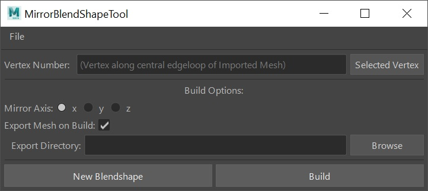

# Blendshape Mirrorer

Author: Eric Hug 



## Requirements
* Maya 2022 (with python 3) through 2024

## Purpose
* To take blendshape-meshes in Maya -- which were exported as obj's from ZBrush -- create mirrored versions of them, and export the new blendshapes as obj's for ZBrush to use as new layers.

## Installation
* Place downloaded folder into your local "maya/scripts" folder. (Make sure it is named "blendshape_mirrorer" and *not* "blendshape_mirrorer-main")
* Open Maya.
* Open Maya's Script Editor. In a Python tab, run the tool using the following python code:
```python
from importlib import reload
from blendshape_mirrorer import view
reload(view)
view.start_up()
```

## Usage
### Export
* **Step 1:** Load the tool and import an obj file of one of your blendshapes you exported from ZBrush.
* **Step 2:** Select a vertex running down the middle of your mesh that was not moved by your blendshape.
* **Step 3:** Make sure your mirror-axis in the tool settings is correct.
* **Step 4:** Choose a directory for to export your mirrored-blendshape to.
* **Step 5:** Press 'Build'.
* **Step 6:** If you have more blendshapes you need to mirror, press "New Blendshape" and repeat the previous steps.

## Important Mirroring NOTES
* **Left and Right:** For now mesh names must have "\_l\_" or "\_r\_" for tool to determine if mesh is a blendshape for the left or right side.